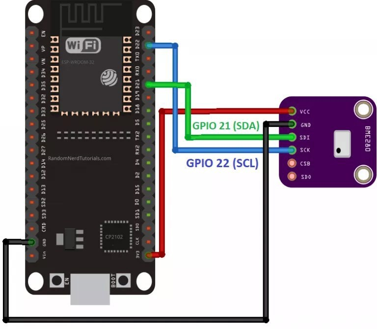
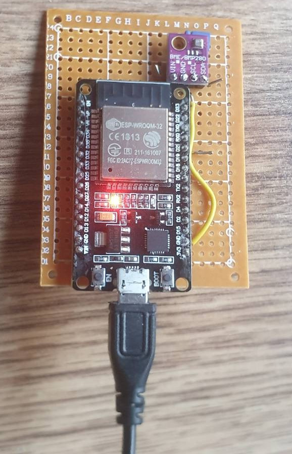
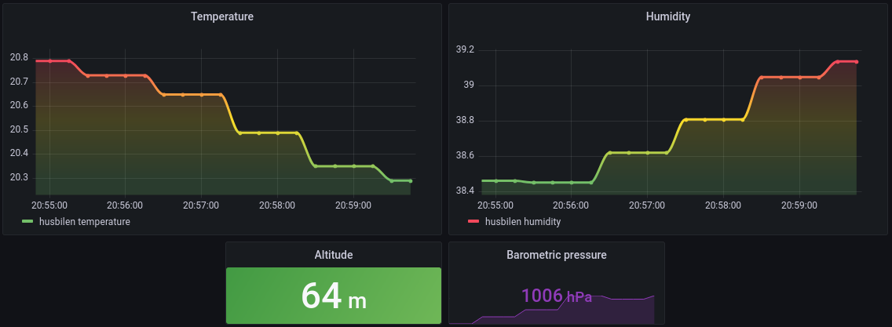

# ESP32 (Espressif) Prometheus Exporter for BME280 environmental Sensors

Exposes a prometheus exporter endpoint for scraping environmental Temperature, Humidity, Pressure and Altitude from a BME280 sensor.
The ESP32 device acts as a HTTP Server on port 80, and prometheus scrape the metrics into the time series database.


## Usage

1. Configure `ssid` and `password` for wifi network within `src/main.cpp`
1. Configure place name
2. Build
3. hit `/metrics` endpoint for reading temperature (C), temperature (F), device resolution, and device count:

```
❯ curl 10.0.1.1/metrics

# HELP temperature_celcius Current temperature in celcius
temperature_celcius{place="myplace"} 20.91
# HELP humidity_percentage Current humidity in Percent
humidity_percentage{place="myplace"} 38.67
# HELP pressure_hpa Current pressure in hPa
pressure_hpa{place="myplace"} 1005.25
# HELP altitude_meter Current altitude in meter
altitude_meter{place="myplace"} 66.81
[tekzn7@fedora esp32_prometheus_exporter_BME
```

# Hardware wiring




### Building

1. Install pio
```sh
pip install -U platformio
```

```sh
pio run                 # Build
pio run --target upload # Upload firmware
```

# Configure Prometheus

Take note of the hostname/IP. The IP is printed in the serial console.
Configure ```prometheus.yml```:

```yaml
scrape_configs:
  # The job name is added as a label `job=<job_name>` to any timeseries scraped from this config.
  - job_name: 'myplace-metrics'
    metrics_path: '/metrics'
    scrape_interval: 10s
    static_configs:
      - targets: ['my_ip_or_hostname:80']
```

